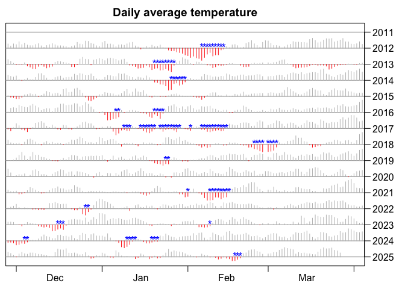

# ice hockey playability prediction

### background

Whenever it gets cold enough during the winter, I love to play ice
hockey on the lakes in Potsdam, see
[bit.ly/eis_mt](https://bit.ly/eis_mt).  
This hobby started 2012: Till Francke gave a course on numerical
modelling in which we predicted ice thickness. I told about my ice
skating experience (as model verification) and he invited me out to
play.  
Since then I’ve been logging the days we could play in [this
file](https://github.com/brry/ice/blob/master/Eishockey_Tage.txt)
*(rightclick on “Raw” -\> “Save target as…”)*.

### predictive modelling

I’m always anxious about whether I get to play soon, so I wanted to
create a computer model that predicts when the ice will hold. This
should be mainly dependent on weather conditions and can be calibrated
with the past playing dates.  
With the [rdwd package](https://github.com/brry/rdwd#rdwd), we can
easily get the weather data for the Potsdam climate station. Using [this
R function](https://github.com/brry/ice/blob/master/icePlot.R), we can
see the days on which the ice was strong enough to play and compute the
prediction correctness rate.  
For a simple (yet very effective) model, I looked whether the previous 4
days all had a maximum temperature below zero.

<!-- -->

This is good enough for me! I see some potentially missed chances in
earlier years and the results of some aggressive advertising through our
mailing list in the spirit of **“the ice shall hold!”** later on (we
never broke through the ice).  
So next time after two or three days of frost, I will be checking 10
different weather prognosis services - and yet probably be even more
excited than I was in previous years.

### vis

Here are the playable days (<span style="color:blue">\*</span>) along
with temperature: <!-- -->

### play

You live near Potsdam and want to join? You can! Very much so!  
Subscribe to the mailing list at [bit.ly/eis_mt](https://bit.ly/eis_mt).

### code

If you want to create a (better) prediction model, this code might be a
nice starting point:

``` r
eistage <- read.table("Eishockey_Tage.txt", stringsAsFactors=FALSE)
eistage <- as.Date(eistage[,1])
source("icePlot.R")
icePlot(eistage, rep(TRUE, length(eistage)), main="Ice hockey rocks")
```

Check out the [source
code](https://github.com/brry/ice/blob/master/README.Rmd) of this
document if you want the weather data code and prediction model I used
for the plot above.

### caveats

The data in the first years is not as complete as in later years
(especially 2012 when I was late to the party). With the increasing
number of people in the mailing list, lag time decreased ^^. Also, in
2019 we discovered a pond that freezes much earlier than the lakes we
played on previously (again, see [bit.ly/eis_mt](https://bit.ly/eis_mt)
for the locations).  
I did not play on all the days myself, but also recorded when other
people from our mailing list were on.

Locations are available in the dataset as well and reflect ice
formation. The ice on the shallow ponds is safe significantly earlier
than on the deeper lakes.

The 4 day model was found by comparing the correct classification rate
(CCR) for several days and with several temperature comparisons.

The cutoff at the end of March is somewhat arbitrary and affects CCR of
course (during summer time it is easy to predict no ice). It has to be
somewhere, so I just chose it. That’s how science works. Deal with it
;-). Or take the code and perform a significance analysis.

**Licence**: This entire project is under GPL3 (as are all my R
packages). Feel free to copy, distribute, edit or enhance as you like,
but please mention me as the original author.

**Hire me** if you think I did a good job coding this. I’m freelancing,
see [brry.github.io](https://brry.github.io)

Feedback is welcome, of course. File an
[issue](https://github.com/brry/ice/issues) or send an
[email](mailto:berry-b@gmx.de) as you like.
